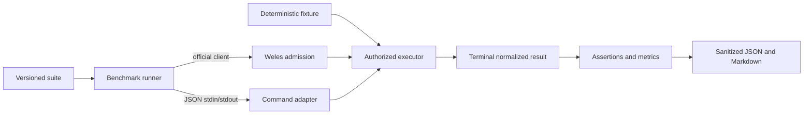

# Weles Benchmark

Weles Benchmark measures authorized browser workflows without turning private
worker state, recordings, or credentials into benchmark data. It runs a
versioned suite through Weles or a process adapter, checks terminal outcomes and
structured assertions, verifies Weles receipts through the official client, and
writes reproducible JSON plus a Markdown report.

The harness reports measurements, not a composite score:

- terminal success rate;
- verified-receipt rate;
- p50, p95, and p99 end-to-end duration;
- first-run versus repeated-run speedup per case;
- CAPTCHA/challenge encounter and solve rates when an adapter exposes them;
- per-case distributions and typed failure counts.

## Boundary

Weles remains the executor. This repository owns benchmark scenarios, the
deterministic fixture, adapter normalization, aggregation, qualification, and
comparison. It does not launch a browser itself, discover trajectories, provision
a Weles organization, or authorize automation of an origin.

Every Weles case still requires an exact origin and action allowlist, a reviewed
trajectory on the approved Weles host, and an organization-scoped bearer. The
bundled suite points only at an operator-controlled fixture and carries no
credential references.



## Install

Node.js 22 or newer is required.

```sh
npm ci --ignore-scripts
npm run build
node dist/cli.js --help
```

`@wisent-ai/weles-client` is pinned to commit
`c171a6e38f6a90c7fbdbad234a5437f166f10650`, so receipt behavior cannot drift
between otherwise identical runs.

## Deterministic fixture

The fixture contains five stable tasks: static extraction, navigation, reversible
form submission, delayed client-side rendering, and a 100-row table scan.

```sh
node dist/cli.js fixture --host 127.0.0.1 --port 8787
```

The server prints its bound address once and stays in the foreground. For a Weles
worker on another machine, publish this fixture through an operator-controlled
HTTPS endpoint; do not expose the development HTTP listener directly to the
internet. Pass that HTTPS origin to the run with `--fixture-origin`.

The reviewed Weles trajectories for `suites/fixture-v1.json` must return these
normalized result objects:

| Action | Required result fields |
|---|---|
| `benchmark_static_extract` | `heading: "Static content"`, `items` containing `"gamma"`, `checksum: "alpha-beta-gamma"` |
| `benchmark_navigation` | `recordId: "record-42"`, `value: "deterministic-detail"` |
| `benchmark_form_submit` | `submitted: true`, `value: "weles-benchmark"` |
| `benchmark_dynamic_render` | `message: "rendered-after-delay"` |
| `benchmark_table_scan` | `rowCount: 100`, `indexChecksum: 5050` |

Trajectory provisioning belongs to Weles because it is the authorization and
execution boundary. The benchmark never substitutes an unreviewed browser script.

## Run against Weles

Configure the provisioned endpoint, organization, bearer, and caller-owned
receipt keys:

```sh
export WELES_API_BASE=https://provisioned-weles-endpoint.example/
export WISENT_ORGANIZATION_ID=00000000-0000-0000-0000-000000000000
export WELES_TOKEN=organization-scoped-bearer
export WELES_RECEIPT_KEYS_FILE=/absolute/path/to/receipt-keys.json

node dist/cli.js run \
  --suite suites/fixture-v1.json \
  --fixture-origin https://fixture.example.com \
  --adapter weles \
  --out results/weles.json
```

The bearer is intentionally accepted only through `WELES_TOKEN`; it cannot be
placed on the command line. `WELES_RECEIPT_KEYS_FILE` contains a JSON object from
key ID to PEM public key. A suite that requires receipts fails before submission
when that trusted key map is absent.

The Weles adapter uses one caller-owned idempotency key per sample, submits once,
and polls exact task status until the public terminal states `succeeded`,
`failed`, or `cancelled`. It performs no hidden submission retry.

## Compare another executor

`--adapter command` runs one child process per sample without a shell. The
executable receives one `weles.benchmark.task.v1` JSON object on stdin and must
write one `weles.benchmark.adapter-result.v1` JSON object to stdout.

```sh
node dist/cli.js run \
  --suite suites/fixture-v1.json \
  --fixture-origin https://fixture.example.com \
  --adapter command \
  --command /absolute/path/to/adapter \
  --command-arg production \
  --adapter-name candidate \
  --out results/candidate.json
```

Only `PATH`, `HOME`, `TMPDIR`, and `LANG` are inherited by default. Explicitly
pass a required variable name with repeated `--command-env NAME`; this prevents a
third-party adapter from receiving `WELES_TOKEN` merely because it exists in the
parent process.

Example adapter output:

```json
{
  "schema": "weles.benchmark.adapter-result.v1",
  "taskId": "adapter-owned-id",
  "status": "succeeded",
  "receiptVerified": false,
  "output": {
    "heading": "Static content",
    "items": ["alpha", "beta", "gamma"],
    "checksum": "alpha-beta-gamma"
  },
  "telemetry": {
    "browserSteps": 4,
    "inputTokens": 800,
    "outputTokens": 60,
    "costUsd": 0.01,
    "challengeFaced": false
  }
}
```

The command is terminated at the case timeout, then killed after a two-second
grace period if it ignores termination. Stdout and stderr are bounded to 1 MiB.
The runner rejects malformed status, telemetry, and schema fields.

## Reports and comparisons

A run writes both the requested JSON and a sibling Markdown report. Regenerate a
report or compare two runs with the exact same materialized suite revision:

```sh
node dist/cli.js report --input results/weles.json --out results/weles.md
node dist/cli.js compare \
  --baseline results/weles.json \
  --candidate results/candidate.json \
  --out results/comparison.md
```

Duration ratios are candidate divided by baseline, so lower is faster. Success
and receipt deltas are percentage points. Repeat speedup is first repetition
duration divided by the median duration of later repetitions; it is a repeat
measurement, not a claim that a particular cache caused the difference.

## Suite contract

`suites/fixture-v1.json` uses `weles.benchmark.suite.v1`. Runtime validation and
`schemas/suite.v1.schema.json` cover:

- stable suite and case identities;
- repetitions, concurrency, timeout, and poll interval;
- exact origin, action, justification, and opaque credential references;
- accepted terminal statuses and receipt requirement;
- JSON Pointer assertions with `equals`, `exists`, and `includes`;
- optional qualification thresholds for success, receipts, and p95 duration.

`${FIXTURE_ORIGIN}` is the only supported template marker. The runner replaces it
with the normalized `--fixture-origin`, then hashes the complete materialized
suite. Runs against different origins therefore cannot be compared accidentally.
Credential-shaped keys in scenario input are rejected; credentials belong in
Weles `credentialRefs`, never in the suite.

## Result privacy and reproducibility

`weles.benchmark.run.v1` records the materialized suite hash, adapter contract,
Node/platform identity, timestamps, sanitized samples, distributions, and
qualification. It deliberately excludes:

- scenario inputs and credential references;
- endpoint URL, organization ID, and bearer;
- raw Weles responses and adapter stdout;
- receipt bodies, evidence, DOM, screenshots, and recordings;
- exception messages and provider pages.

Only typed status, timing, receipt-verification state, assertion counts, failure
codes, and optional numeric/boolean telemetry survive. This is enough to compare
behavior without making the result artifact a second store for customer data.

## License

MIT. A license to this harness does not grant access to Weles or authorize
browser automation of any target.
