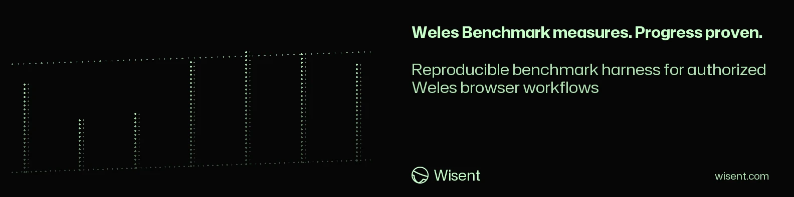
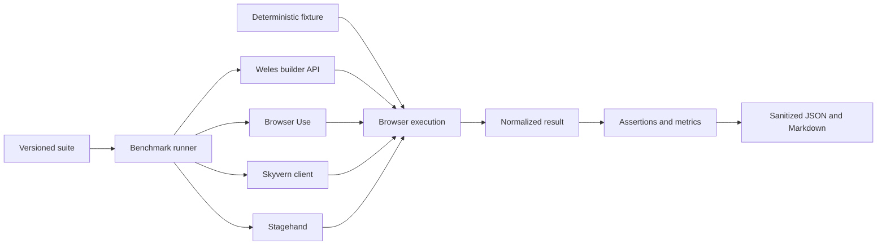

<!-- wisent-banner:start -->
<p align="center">
  
</p>
<!-- wisent-banner:end -->

<!-- wisent-readme-signals:start -->
[](https://github.com/wisent-ai/weles-benchmark) [](https://github.com/wisent-ai/weles-benchmark/issues) [](https://wisent.com) [](https://discord.gg/qRjpkthq54) [](https://www.linkedin.com/company/wisent-ai/) [](https://x.com/wisentai) [](https://calendly.com/lbartoszcze)
<!-- wisent-readme-signals:end -->

# Weles Benchmark

Weles Benchmark measures Weles, Browser Use, Skyvern, and Stagehand against the
same versioned browser tasks. The harness owns deterministic fixtures, normalized
adapter results, assertions, aggregation, qualification, and comparison; each
adapter retains its own browser and agent implementation.

The result is not a composite score. It records:

- terminal and assertion success rates;
- p50, p95, and p99 end-to-end duration;
- first-run versus repeated-run speedup when repetitions exceed one;
- browser steps, model tokens, and model cost when the client exposes them;
- verified-receipt rate for adapters and suites that use signed receipts;
- per-case distributions and typed failure codes.

## Execution boundary

Browser execution belongs on the Stado-selected dedicated host. The benchmark
CLI itself may run anywhere, but the bundled direct adapters launch their
browsers on the machine running the CLI. Do not run the browser adapters on an
operator workstation.

Weles uses its authenticated `/weles-builder` endpoint. Browser Use and
Stagehand run local headless browsers and send model inference through Brama.
Skyvern uses the official `@skyvern/client` against the configured Skyvern API.
No adapter receives another adapter's credential.



## Install

Node.js 22 or newer is required. Browser Use additionally requires Python 3.11
or newer.

```sh
npm ci --ignore-scripts
npm run build
python3 -m venv .venv
.venv/bin/python -m pip install -r requirements-browser-use.txt
```

The Node lockfile pins Stagehand 3.4.0 and `@skyvern/client` 1.0.0. Python
requirements pin Browser Use 0.13.7, Playwright 1.55.0, and Skyvern 1.0.48.

## Common fixture suite

`suites/web-agent-v1.json` contains five tasks:

1. static extraction;
2. link navigation;
3. reversible form submission;
4. delayed client-side rendering;
5. a 100-row structured table scan.

Each task includes the natural-language instruction shown to every agent and an
output-only JSON schema derived from its assertions. Expected values remain in
the runner and are not added to the agent prompt.

Start the fixture on the same dedicated host as the direct adapters:

```sh
node dist/cli.js fixture --host 127.0.0.1 --port 8787
```

Then use `http://127.0.0.1:8787` as `--fixture-origin`. A remote Skyvern Cloud
browser cannot reach loopback; publish the fixture through an
operator-controlled HTTPS endpoint for that adapter. Never expose the plain HTTP
fixture directly to the internet.

`suites/fixture-v1.json` remains the receipt-oriented Weles suite. The common
`web-agent-v1.json` suite does not require receipts because the competing
clients do not issue Weles receipts.

## Weles

```sh
export WELES_API_BASE=http://dedicated-host:8788
export WELES_TOKEN=organization-scoped-bearer

node dist/cli.js run \
  --suite suites/web-agent-v1.json \
  --fixture-origin http://127.0.0.1:8787 \
  --adapter weles \
  --out results/weles.json
```

The adapter sends only the task instruction to `/weles-builder`, waits for the
synchronous run, normalizes the returned `value`, and records the Weles run ID.
The bearer is accepted only through `WELES_TOKEN`.

## Browser Use through Brama

```sh
export BRAMA_UPSTREAM_BASE_URL=http://127.0.0.1:8080/v1
node scripts/brama-openai-proxy.mjs &
export BRAMA_BASE_URL=http://127.0.0.1:8789/v1
export BRAMA_API_KEY=workload-scoped-brama-token
export BRAMA_MODEL=weles/agent/primary
export BROWSER_EXECUTABLE_PATH=/absolute/path/to/Chromium

node dist/cli.js run \
  --suite suites/web-agent-v1.json \
  --fixture-origin http://127.0.0.1:8787 \
  --adapter browser-use \
  --python .venv/bin/python \
  --out results/browser-use.json
```

The Python client runs Browser Use 0.13.7 in headless DOM mode, disables its
secondary judge, and records its step, token, and cost totals. The loopback
request adapter removes OpenAI-only optional fields and maps
`max_completion_tokens` onto Brama's provider-neutral request contract; it
forwards the workload-scoped Brama bearer and never accepts provider keys.

## Stagehand through Brama

```sh
export BRAMA_UPSTREAM_BASE_URL=http://127.0.0.1:8080/v1
node scripts/brama-openai-proxy.mjs &
export BRAMA_BASE_URL=http://127.0.0.1:8789/v1
export BRAMA_API_KEY=workload-scoped-brama-token
export BRAMA_MODEL=weles/agent/primary
export BROWSER_EXECUTABLE_PATH=/absolute/path/to/Chromium

node dist/cli.js run \
  --suite suites/web-agent-v1.json \
  --fixture-origin http://127.0.0.1:8787 \
  --adapter stagehand \
  --out results/stagehand.json
```

Stagehand 3.4.0 runs locally in DOM agent mode. `--model` and
`--browser-executable` override the corresponding environment values without
putting credentials on the command line. `scripts/run-comparison.sh` starts the
loopback Brama request adapter once for Browser Use, Stagehand, and embedded
Skyvern, then terminates it with the fixture.

## Skyvern

```sh
export SKYVERN_API_KEY=skyvern-api-key
# Optional for a self-hosted deployment:
export SKYVERN_BASE_URL=https://skyvern.example.com

node dist/cli.js run \
  --suite suites/web-agent-v1.json \
  --fixture-origin https://fixture.example.com \
  --adapter skyvern \
  --out results/skyvern.json
```

The official client submits one task, requests the suite-derived extraction
schema, polls `getRun` to a terminal state, and performs no hidden task retry.
`SKYVERN_ENGINE` defaults to `skyvern-2.0`; `SKYVERN_MAX_STEPS` defaults to 20.
A self-hosted URL may omit `SKYVERN_API_KEY` when that deployment permits it.

When no remote Skyvern endpoint is configured, `scripts/run-comparison.sh` uses
Skyvern 1.0.48 in its supported embedded mode with an in-memory SQLite database
and a dedicated virtual environment. `scripts/skyvern-local-client.py` receives
the same normalized task contract as every command adapter, starts headless
Chromium, reaches Brama through the same loopback request adapter, and returns
the official Skyvern task output. No Docker daemon, PostgreSQL service, or
provider credential is required.

## Command adapter

`--adapter command` runs one child process per sample without a shell. The
executable receives one `weles.benchmark.task.v1` JSON object on stdin and must
write one `weles.benchmark.adapter-result.v1` JSON object to stdout.

```sh
node dist/cli.js run \
  --suite suites/web-agent-v1.json \
  --fixture-origin https://fixture.example.com \
  --adapter command \
  --command /absolute/path/to/adapter \
  --command-arg production \
  --adapter-name candidate \
  --out results/candidate.json
```

Only `PATH`, `HOME`, `TMPDIR`, and `LANG` are inherited by default. Pass each
required variable name with `--command-env NAME`. Child output is bounded to 1
MiB, and the process is terminated at the case timeout.

## Reports and comparisons

Each run writes a JSON artifact and a sibling Markdown report. Compare runs only
when they carry the same materialized suite hash:

```sh
node dist/cli.js compare \
  --baseline results/weles.json \
  --candidate results/stagehand.json \
  --out results/weles-vs-stagehand.md
```

Duration ratios are candidate divided by baseline, so lower is faster. Success
and receipt deltas are percentage points. Repeat speedup is first repetition
duration divided by the median duration of later repetitions.

## Suite contract

`weles.benchmark.suite.v1` validates:

- stable suite and case identities;
- one natural-language instruction per case;
- repetitions, concurrency, timeout, and poll interval;
- exact origin, action, justification, and opaque credential references;
- accepted terminal statuses and receipt requirements;
- JSON Pointer assertions using `equals`, `exists`, and `includes`;
- optional qualification thresholds for success, receipts, and p95 duration.

`${FIXTURE_ORIGIN}` is the only template marker. The runner materializes it and
hashes the complete suite, preventing comparison across different fixture
origins. Credential-shaped scenario keys are rejected.

## Result privacy

`weles.benchmark.run.v1` stores the materialized suite hash, adapter identity,
Node/platform identity, timestamps, sanitized samples, distributions, and
qualification. It excludes task inputs, credentials, endpoint URLs, raw adapter
responses, DOM, screenshots, recordings, and provider pages.

## License

MIT. A license to this harness does not grant access to Weles, Brama, Skyvern,
or any target origin.
