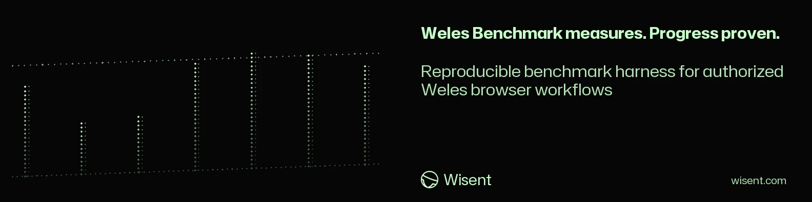

  

# weles-benchmark (retired)

The code in this repository is superseded and no longer maintained. Weles is
measured against its rivals by **Probierz**, which runs every product's
benchmark the same way.

| What it was here | Where it is now |
|---|---|
| `suites/web-agent-v1.json` and `suites/fixture-v1.json` | [`weles/benchmark/web-agent-v1.json`](https://github.com/wisent-ai/weles/tree/main/benchmark) |
| the fixture server `src/fixture.ts` | [`weles/benchmark/fixture.mjs`](https://github.com/wisent-ai/weles/tree/main/benchmark) |
| the Weles and Stagehand adapters | [`weles/benchmark/contenders/`](https://github.com/wisent-ai/weles/tree/main/benchmark/contenders) |
| the Browser Use and Skyvern adapters | drafted by `probierz benchmark author weles --contender <rival> --suite web-agent-v1` from the rivals the Stado catalog names |
| `weles-benchmark run`, the comparison and metrics | `probierz benchmark run weles --suite web-agent-v1`, `standing`, `compare` |

The command reference is at
[probierz.wisent.com/docs/cli/benchmark](https://probierz.wisent.com/docs/cli/benchmark).

## License

Apache License 2.0; see [LICENSE](LICENSE).
